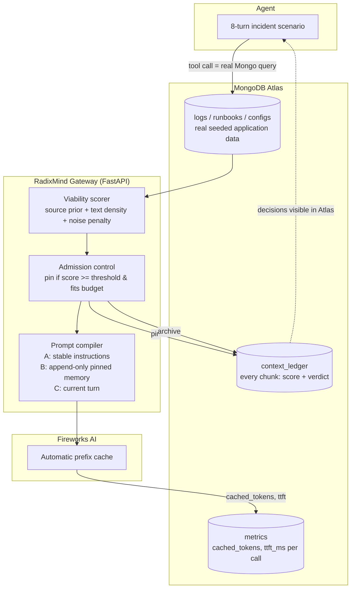

# RadixMind

**An agent whose memory lives in MongoDB — and decides what deserves the model's cache.**

RadixMind is an incident-response copilot backed by a viability-aware memory gateway. Every piece of tool output an agent gathers is scored for reusability and information density before it ever touches a prompt. High-value evidence is pinned into a byte-stable prefix that the model provider's cache serves for pennies; low-value noise is archived to MongoDB and kept out of the model's way. MongoDB is not just the agent's memory — it is the ledger, the admission-control policy, and the metrics store, all as collections, indexes, and aggregation pipelines. No fine-tuning. No RL. The learning lives in database rows.

Built in ~4 hours for the MongoDB Persistent Context Sprint, Build Fest, Aug 13 2026.

---

## The result

Same simulated production incident, same agent, same 8-turn investigation, run twice — once with context dumped naively into every prompt, once through RadixMind's admission layer. Both agents reached the **identical, correct root-cause diagnosis.** The difference is what it cost to get there, measured from live Fireworks AI API calls and read directly out of Atlas:

| | Baseline (naive) | RadixMind |
|---|---:|---:|
| Cache hit rate | 0.9% | **75.9%** |
| Avg time-to-first-token | 657 ms | **495 ms** |
| Total prompt tokens (8 turns) | 90,750 | **6,434** (14× fewer) |
| Diagnosis | Correct | Correct |

The starkest single data point: turn 2 hands the agent a 12,000-token log dump. RadixMind's scorer rates it 0.08 — mostly noise — archives it to MongoDB, and the prompt for that turn stays at **142 tokens.** The one causal line inside that dump (a database connection pool silently capped by a config-only deploy) is retrieved later through a *targeted* query and pinned on its own merit.

---

## Architecture



Segments A and B are held byte-stable and append-only across turns — that discipline is what lets Fireworks' provider-side prefix cache actually reuse them turn over turn. Segment C (the live question) is the only part that changes.

---

## Why this is different from "agent + vector memory"

Most agent-memory demos store everything and retrieve by similarity. RadixMind's ledger makes an **admission decision** on every chunk — pin, archive, or (for long-but-valuable content) summarize-then-pin — and that decision, plus its viability sub-scores, is itself a MongoDB document. The database isn't a passive store; it's the control plane deciding what's allowed into the model's expensive working memory. Reuse statistics on pinned entries are designed to feed back into future admission priors — a persistent, self-updating policy whose state lives in rows, not gradients.

---

## Quickstart

```bash
python -m venv venv
venv\Scripts\Activate.ps1        # Windows
pip install -r requirements.txt

cp .env.example .env             # fill in MONGODB_URI and FIREWORKS_API_KEY

python seed.py                   # loads the incident scenario into Atlas
python scorer.py                 # unit-tests the viability scorer

# terminal 1
uvicorn api.main:app --port 8000

# terminal 2
python driver.py                 # runs both modes end-to-end
python aggregate.py              # prints the comparison table above
```

**Note:** episode memory is held in the gateway process. Restart `uvicorn` before every fresh `driver.py` run, or a repeated episode ID will be rejected as an out-of-order turn.

---

## Project layout

| File | Role |
|---|---|
| `api/main.py` | `POST /turn` — orchestrates scoring, admission, prompt compilation, streaming |
| `api/scoring.py`, `scorer.py` | Pure viability scorer: source-type prior + text density − noise penalty |
| `api/prompt_compiler.py` | A/B/C prompt assembly; bounded, append-only Segment B |
| `api/fireworks_client.py` | Streaming client for Fireworks' OpenAI-compatible API |
| `api/metrics.py` | Writes to `metrics` and upserts `context_ledger` |
| `scenario.py` | The seeded incident: a deterministic log dump with one buried root cause |
| `seed.py` | Loads the scenario into Atlas as real, queryable collections |
| `driver.py` | Replays the incident through the gateway in both modes |
| `aggregate.py` | Reads live metrics from Atlas and prints the comparison table |
| `cache_proof.py` | Standalone proof that Fireworks' prefix cache is real and working |

---

## MongoDB, specifically

- **`context_ledger`** — one document per unique chunk (deduplicated by content hash): viability score, source type, pinned/archived status, reuse count.
- **`metrics`** — one document per agent turn per mode: real `cached_tokens` and `ttft_ms` from the Fireworks API response.
- **`logs` / `runbooks` / `service_configs` / `deploys` / `status_events`** — the incident's application data, seeded as real collections so a "targeted log query" is a literal `db.logs.find({"level": "ERROR"})`, not a string slice.
- Compound indexes on `(episode_id, turn)` and a unique index on `content_hash` back every query used above.

---

## Honest notes

- The incident is a deterministic, seeded scenario — clearly disclosed, not presented as a live production system.
- Every number in the results table is a real Fireworks API response captured live and read back from Atlas; nothing here is synthetic or hand-typed.
- "RadixAttention" refers to SGLang's engine; this build serves through Fireworks AI, which provides its own automatic prefix caching with equivalent real cached-token telemetry.

## Roadmap

- Wire `reuse_count` into live admission priors (currently instrumented, not yet closing the loop)
- Atlas Vector Search for redundancy scoring across pinned entries
- A live dashboard driven by MongoDB change streams
- Viability-weighted eviction inside the serving engine itself, with MongoDB as an L3 cache tier

---

## Team

Built by a 3-person team at MongoDB .local Build Fest, Persistent Context Sprint, Aug 13 2026.
